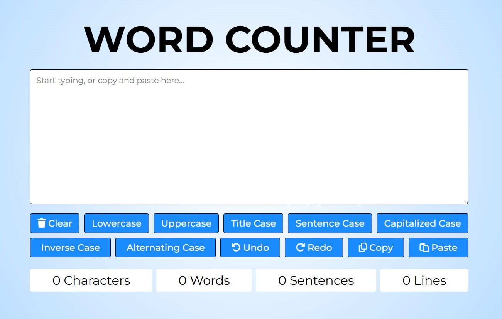

# Word Counter

## Project Summary

Word Counter is a clean, responsive web application designed to help users instantly analyze their text input. It provides real-time statistics including word count, character count (with and without spaces), sentence count, and line count. In addition to analytical features, it also offers helpful utilities such as converting text to uppercase, lowercase, capital case, sentence case, clearing the text, and copying to clipboard — all in a single, intuitive interface.

The primary goal of this project is to offer a lightweight, user-friendly tool for writers, editors, students, and professionals who frequently work with text and need to monitor or manipulate its structure. The app is built using only vanilla HTML, CSS, and JavaScript, demonstrating how powerful simple web technologies can be when used effectively.

The application is fully responsive, ensuring optimal usability on both desktop and mobile devices. It also includes accessibility features like keyboard navigation and visible focus outlines. Every change in the text area is reflected immediately in the live statistics display, making the experience seamless and interactive.

## Table of Contents

- [Mock Up](#mock-up)
- [Instructions](#instructions)
- [Key Features](#key-features)
- [Deployed Aplication](#deployed-application)

## Mock-Up

The following image shows the web application's appearance and functionality:

## Instructions

To use this application, follow these simple steps:

- Download the project files or clone the repository.

- Open `index.html` in your preferred browser.

That's it — the app is fully functional upon opening the file.

## Key Features

**Clear Button:** Instantly clear the text area to start fresh.

**Clipboard Functionality:** Easily copy the current text to your clipboard with one click.

**Hover Text Change:** Subtle hover effect that changes button labels for added interactivity.

**Responsive Design:** Fully responsive layout that adapts to both desktop and mobile devices.

**Real-Time Text Analysis:** Instantly displays word, character, sentence, and line counts as you type.

**Case Conversion Tools:** Quickly convert input text to uppercase, lowercase, capital case, or sentence case.

## Deployed Application

[Word Counter](https://gilmerperez.github.io/word-counter/)